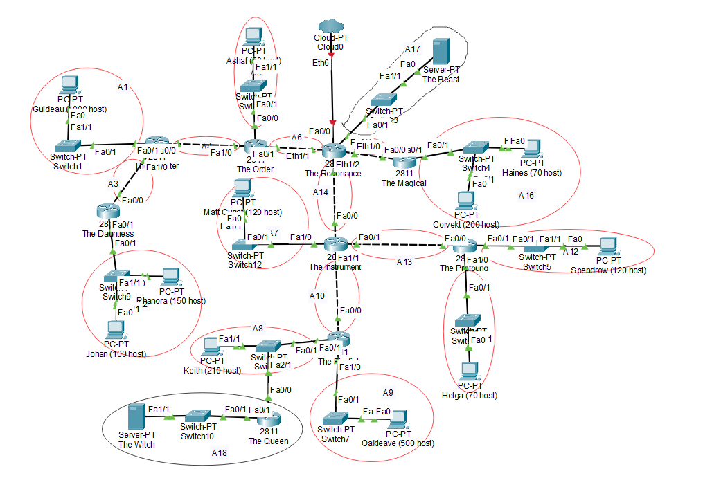
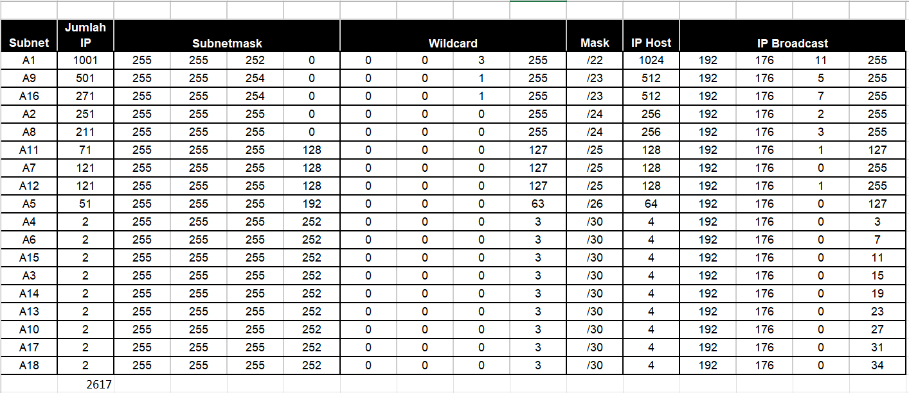
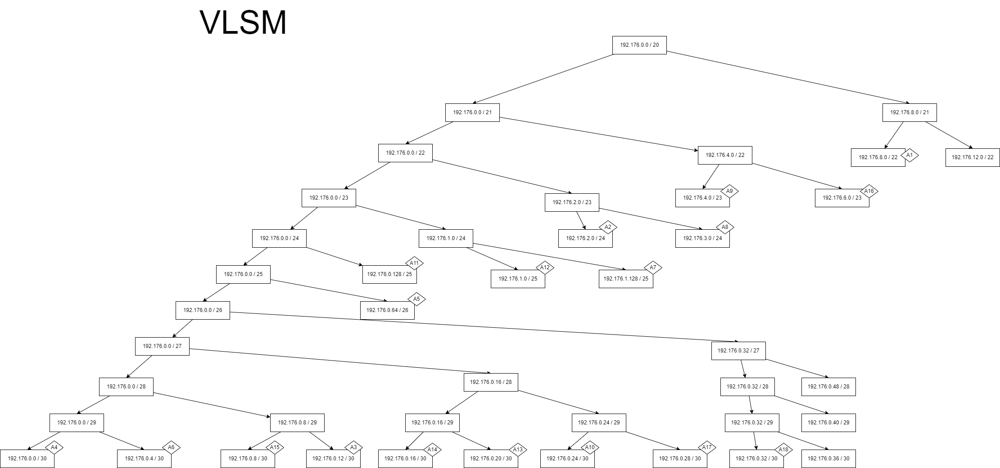
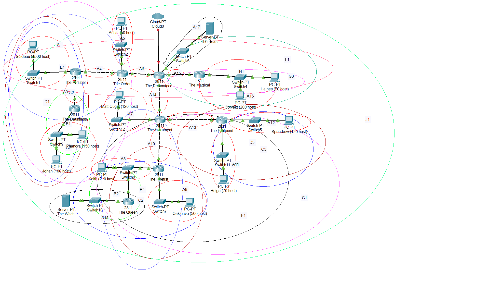
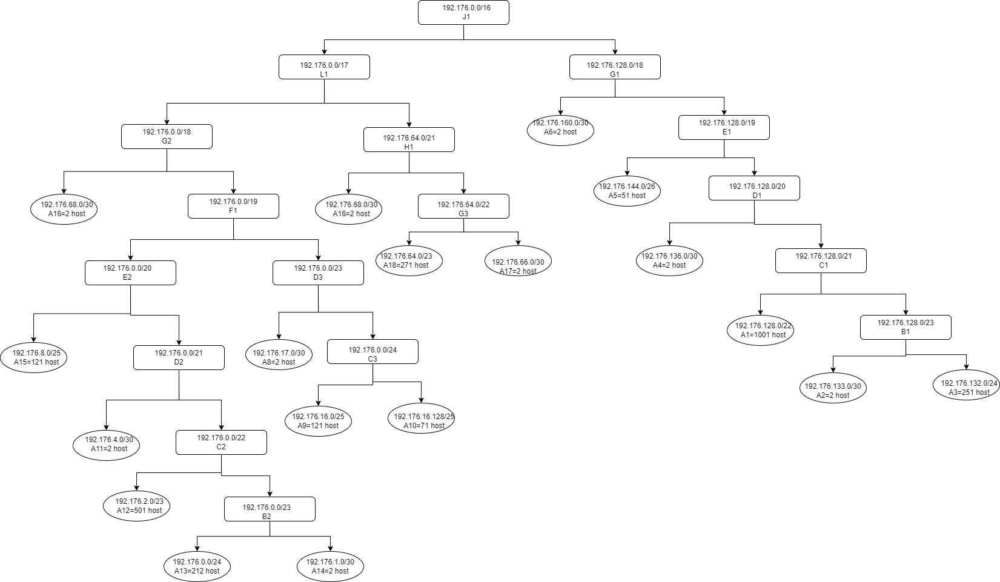

# Laporan Praktikum JARKOM Kelompok B07 #

| Nama                      | NRP           |
| ------------------------- | ------------- |
| Danial Farros Maulana     | 5025201004    |
| Rendi Dwi Francisko       | 5025201056    |
| Ahmad Ibnu Malik Rahman   | 5025201232    |

# VLSM
## Cisco

## TABEL SUBNETTING

## POHON

# CIDR

## POHON cidr

kendala
- penentuan pohon cidr
- subnetting cidr